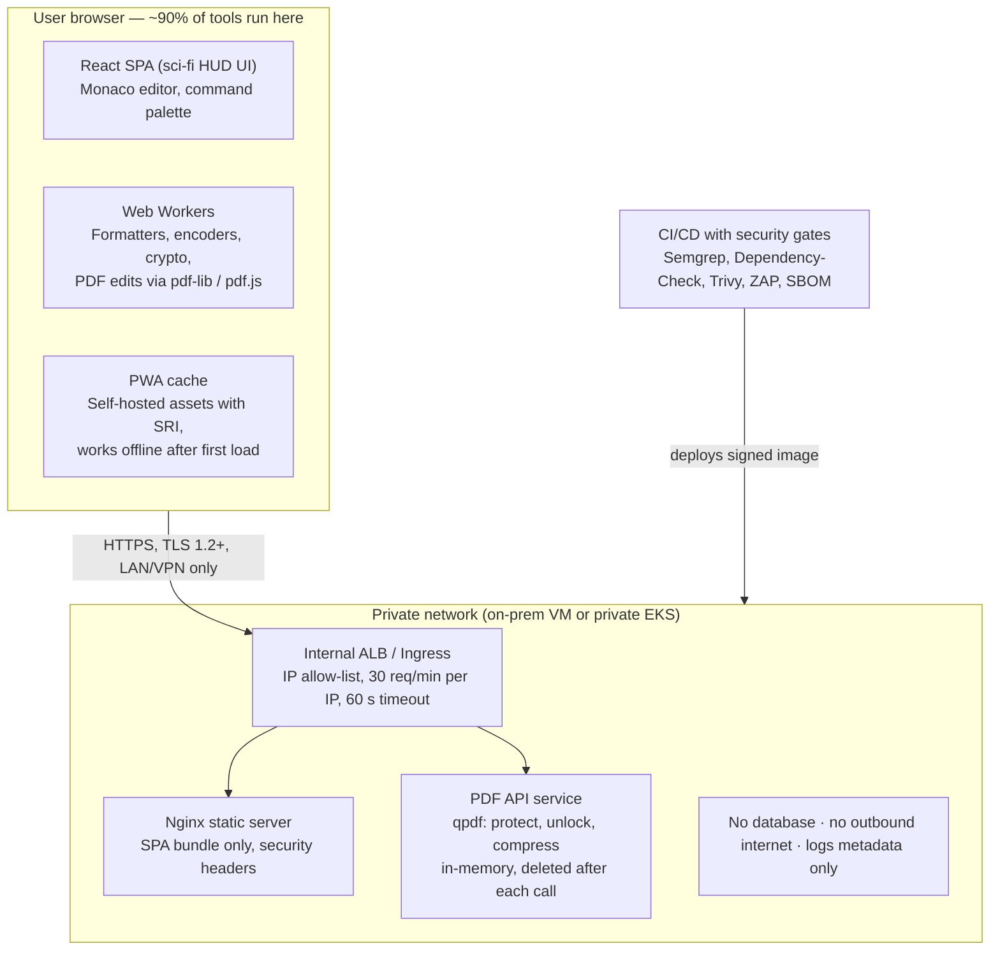

# DevToolkit — Self-Hosted Utilities Portal: Requirements

Version 1.0 · Oct 4, 2026 · Author: Sandeep

---

## 1. Overview

DevToolkit is a self-hosted web portal that gives teams safe, offline-grade utilities (formatters, encoders, crypto, PDF editing), so no sensitive data is ever pasted into public websites.

**Problem.** People routinely paste JSON payloads, SQL, API tokens, customer PDFs and config files into public sites such as online formatters and PDF editors. That creates an uncontrolled data-leak path for PII and credentials, and exposure under the DPDP Act 2023 and regulatory IT-governance rules.

**Objectives**

1. Zero data egress: every operation runs on the user’s device or a private network, with no third-party API calls.
2. One portal replacing 15+ public tools used today.
3. OWASP Top 10 (2021) controls designed in and verified by SAST/DAST before go-live.
4. Top-tier UX: a sci-fi HUD interface, themable to brand colours, that people prefer over public tools.

**In scope**

- Code and data formatters, validators and minifiers
- Encoding/decoding, hashing, encryption/decryption, key generation
- PDF tools: merge, split, delete, reorder, rotate, extract, insert pages, watermark, compress, image-to-PDF
- Data converters, general developer utilities, unit converters (length, area, land units), and an offline cheat sheet library

**Out of scope (v1)**

- User login, SSO, roles and audit trails (by decision)
- Storing any user content server-side
- OCR, in-place PDF text editing, e-signatures (candidate v2 items)
- Internet or external exposure of any kind

## 2. Users, assumptions and constraints

Anyone with access to the deployment is a user; v1 has no role distinctions.

| User group | Typical use |
| --- | --- |
| Developers / QA | JSON, SQL, Java, JS formatting; JWT decode; Base64; regex testing |
| IT Ops / Infra / Security | Hashes, certificate decode, key generation, cron, timestamps |
| Business / Operations | PDF merge/split/delete pages for case files and scanned documents |
| Product / Analysts | CSV↔JSON, Excel preview, text diff |

**Hard constraints**

- **No login, no audit, no telemetry of content.** The app holds no user content after the request ends.
- **Private network only.** Reachable only from a LAN/VPN; no public DNS, no internet ingress.
- **No external APIs or CDNs at runtime.** Every JS, CSS and font asset is self-hosted; the container has no outbound internet.
- **Free, open-source libraries only** (MIT, Apache-2.0, BSD, ISC). AGPL/GPL libraries are excluded unless Legal approves.
- **Client-side first.** Processing runs in the browser by default, so data never leaves the user's machine. The server is used only where a browser cannot do the job (e.g., PDF encryption, heavy PDF compression).

**Assumptions**

- Users run Chrome or Edge (last 2 versions).
- Hosted on private infrastructure (on-prem VM or private EKS/ECS behind an internal load balancer).
- Max PDF size 100 MB; max text input 10 MB.

## 3. Functional requirements

The portal has eight modules with 60+ tools, plus a cheat sheet library; 90% of tools run fully in the browser. Every tool follows the common behaviour in 3.0.

### 3.0 Common behaviour (all tools)

- **FR-C1** Input pane and output pane side by side (stacked on narrow screens), using Monaco editor with syntax highlighting.
- **FR-C2** Input via paste, typing, file drag-and-drop or file picker; output via copy-to-clipboard and download.
- **FR-C3** Auto-detect input type where possible (e.g., JSON vs XML vs Base64) and suggest the right tool.
- **FR-C4** Errors show line/column and a plain-English message; a tool never crashes the page.
- **FR-C5** Global search / command palette (Ctrl+K) to jump to any tool.
- **FR-C6** Favourites and recent tools are saved in browser localStorage only — tool names, never content.
- **FR-C7** A "Clear all" button wipes input, output and memory for that tool.
- **FR-C8** A visible "Processed locally — nothing leaves your device" badge on client-side tools, and "Processed on internal server, not stored" on server-side tools.

### 3.1 Formatters and validators

| ID | Tool | Key behaviour | Library (licence) | Runs in |
| --- | --- | --- | --- | --- |
| FR-F1 | JSON | Format, minify, validate, sort keys, tree view, JSONPath query, JSON Schema validation | Native JSON, ajv (MIT), jsonpath-plus (MIT) | Browser |
| FR-F2 | SQL | Format/minify with dialect choice: Oracle PL/SQL, MySQL, PostgreSQL, T-SQL, MariaDB; keyword case option | sql-formatter (MIT) | Browser |
| FR-F3 | Java | Format to Google-style indentation; report syntax errors | Prettier + prettier-plugin-java (MIT / Apache-2.0) | Browser |
| FR-F4 | JavaScript / TypeScript | Format and minify; configurable indent, quotes, semicolons | Prettier (MIT), Terser (BSD) for minify | Browser |
| FR-F5 | HTML / CSS / SCSS | Format and minify | Prettier (MIT) | Browser |
| FR-F6 | XML / SOAP | Format, minify, well-formedness check, XPath query | xml-formatter (MIT), native DOMParser | Browser |
| FR-F7 | YAML / Markdown / GraphQL | Format and validate; Markdown live preview | Prettier (MIT), js-yaml (MIT), marked + DOMPurify | Browser |
| FR-F8 | Text diff | Side-by-side and inline diff of two texts or two JSON documents (semantic JSON diff) | Monaco diff editor (MIT), jsondiffpatch (MIT) | Browser |

### 3.2 Encoding and decoding

| ID | Tool | Key behaviour | Library (licence) | Runs in |
| --- | --- | --- | --- | --- |
| FR-E1 | Base64 | Text and file ↔ Base64; URL-safe variant; Base64 → file download (with image preview) | Native btoa/atob + TextEncoder | Browser |
| FR-E2 | URL encode/decode | Component and full-URL modes; URL parser showing query params as a table | Native | Browser |
| FR-E3 | HTML entities | Encode/decode named and numeric entities | he (MIT) | Browser |
| FR-E4 | Hex / Binary / Base32 / Base58 | Text ↔ each encoding | Native + base-x (MIT) | Browser |
| FR-E5 | Unicode / UTF-8 escape | \uXXXX escape/unescape; charset inspector showing code points | Native | Browser |
| FR-E6 | JWT decoder | Decode header/payload, show expiry in IST, verify HS/RS/ES signature with a supplied key | jose (MIT) | Browser |
| FR-E7 | Certificate / PEM decoder | Show subject, issuer, SAN, validity and fingerprint of an X.509 certificate or CSR | pkijs + asn1js (BSD-3) | Browser |
| FR-E8 | Gzip / Deflate | Compress/decompress text and Base64 payloads | fflate (MIT) | Browser |

### 3.3 Hashing, encryption and keys

| ID | Tool | Key behaviour | Library (licence) | Runs in |
| --- | --- | --- | --- | --- |
| FR-K1 | Hash generator | MD5, SHA-1, SHA-256/384/512, SHA-3, CRC32 for text and files; compare to an expected hash; MD5/SHA-1 labelled "legacy, not secure" | Web Crypto, hash-wasm (MIT) | Browser |
| FR-K2 | HMAC | HMAC-SHA256/384/512 with key in text, hex or Base64 | Web Crypto | Browser |
| FR-K3 | Password hashing | Generate and verify bcrypt, Argon2id, PBKDF2 | hash-wasm (MIT) | Browser |
| FR-K4 | Symmetric encryption | AES-GCM, AES-CBC, AES-CTR (128/256); key from passphrase (PBKDF2) or raw key; IV handling explained in UI | Web Crypto | Browser |
| FR-K5 | Asymmetric encryption | RSA-OAEP encrypt/decrypt; RSA-PSS and ECDSA sign/verify | Web Crypto | Browser |
| FR-K6 | Key and secret generator | RSA 2048/4096 and EC P-256/P-384 key pairs (PEM, JWK); random secrets; strong password generator; UUID v4/v7 | Web Crypto, uuid (MIT) | Browser |
| FR-K7 | File encryption | Encrypt/decrypt any file with a password (AES-256-GCM) into a .enc file | Web Crypto | Browser |

### 3.4 PDF tools

All pages appear as draggable thumbnails, and every operation shows a preview before download.

| ID | Tool | Key behaviour | Library (licence) | Runs in |
| --- | --- | --- | --- | --- |
| FR-P1 | Merge | Combine 2–50 PDFs; reorder files before merging | pdf-lib (MIT), pdf.js (Apache-2.0) for thumbnails | Browser |
| FR-P2 | Split | By page range, every N pages, or one file per page; ZIP output | pdf-lib, JSZip (MIT) | Browser |
| FR-P3 | Delete pages | Select thumbnails or type ranges (e.g., 2,5-7) | pdf-lib | Browser |
| FR-P4 | Add / insert pages | Insert blank pages, or pages from another PDF or image, at any position | pdf-lib | Browser |
| FR-P5 | Reorder and rotate | Drag-and-drop reorder; rotate 90/180/270 per page or all pages | pdf-lib, SortableJS (MIT) | Browser |
| FR-P6 | Extract pages | Save selected pages as a new PDF | pdf-lib | Browser |
| FR-P7 | Image ↔ PDF | JPG/PNG to PDF (page size, margins); PDF pages to PNG | pdf-lib, pdf.js | Browser |
| FR-P8 | Watermark and page numbers | Text watermark (e.g., "Confidential") with opacity and angle; page numbering | pdf-lib | Browser |
| FR-P9 | Metadata | View and strip author/title/producer metadata | pdf-lib | Browser |
| FR-P10 | Protect / unlock | Add a password (AES-256); remove a password the user knows | qpdf (Apache-2.0) | Server, in-memory |
| FR-P11 | Compress | Lossless structural compression and image downsampling | qpdf (Apache-2.0) + server-side image re-encode | Server, in-memory |

### 3.5 Data converters

| ID | Tool | Key behaviour | Library (licence) | Runs in |
| --- | --- | --- | --- | --- |
| FR-D1 | CSV ↔ JSON | Delimiter and header options; preview grid | PapaParse (MIT) | Browser |
| FR-D2 | JSON ↔ YAML ↔ XML | Round-trip conversion | js-yaml, fast-xml-parser (MIT) | Browser |
| FR-D3 | Excel → CSV / JSON | Pick a sheet; preview | SheetJS Community Edition (Apache-2.0) | Browser |
| FR-D4 | JSON → code classes | Generate Java POJO, TypeScript interface or C# class from sample JSON | quicktype-core (Apache-2.0) | Browser |
| FR-D5 | SQL INSERT generator | CSV/JSON → INSERT statements for the chosen dialect | Custom, on PapaParse | Browser |

### 3.6 Developer utilities

| ID | Tool | Key behaviour | Library (licence) | Runs in |
| --- | --- | --- | --- | --- |
| FR-U1 | Regex tester | Live match highlighting, groups, replace, flags, quick reference | Native RegExp (with timeout guard) | Browser (Web Worker) |
| FR-U2 | Timestamp converter | Epoch s/ms ↔ date in IST/UTC/any zone; ISO-8601 | date-fns + date-fns-tz (MIT) | Browser |
| FR-U3 | Cron explainer | Human-readable cron (Unix, Quartz, AWS EventBridge); next 10 runs | cronstrue (MIT), cron-parser (MIT) | Browser |
| FR-U4 | Case and text tools | camel/snake/kebab/upper case; trim, dedupe lines, sort, word/char count | change-case (MIT) | Browser |
| FR-U5 | Number base | Decimal/hex/octal/binary; byte-size converter | Native BigInt | Browser |
| FR-U6 | QR code | Generate a QR code from text/URL (PNG/SVG); read a QR code from an image | qrcode (MIT), jsQR (Apache-2.0) | Browser |
| FR-U7 | Colour converter | HEX/RGB/HSL with picker and contrast checker | Native | Browser |
| FR-U8 | Data masker | Mask PAN, Aadhaar, mobile, email and account numbers in text/JSON before sharing | Custom regex rules | Browser |
| FR-U9 | Lorem / test data | Dummy Indian names, addresses and PAN-format strings (fake values, flagged as test data) | @faker-js/faker (MIT) | Browser |

### 3.7 Unit converters

Conversion is instant and two-way as the user types: editing any field updates all the others. Includes Indian land and area units used in property valuation.

| ID | Tool | Key behaviour | Library (licence) | Runs in |
| --- | --- | --- | --- | --- |
| FR-M1 | Length | Feet + inches ↔ cm ↔ m ↔ mm ↔ yards; accepts mixed input like 5' 8" or 5 ft 8 in; decimal-places setting | convert-units (MIT) or custom factors | Browser |
| FR-M2 | Height quick view | Feet/inches ↔ cm side by side, with a reference table (4' 0" to 7' 0" in 1-inch steps) | Custom | Browser |
| FR-M3 | Area | sq ft ↔ sq m ↔ sq yd ↔ acre ↔ hectare ↔ guntha ↔ cent ↔ bigha (state-wise factor, selectable) | Custom factors table | Browser |
| FR-M4 | Carpet / built-up / super built-up | Estimate each from one input using a user-entered loading %; shown as an estimate, not a valuation | Custom | Browser |
| FR-M5 | Other units | Weight (kg ↔ lb), temperature (°C ↔ °F), data size (KB/MB/GB, 1000 vs 1024), volume | convert-units (MIT) | Browser |

**Acceptance:** results match standard (NIST) conversion factors to 4 decimal places (1 in = 2.54 cm exactly, 1 ft = 30.48 cm, 1 sq ft = 0.09290304 sq m). State-specific land units (bigha, guntha) display the factor used and its state. Every field has a copy-result button.

### 3.8 Cheat sheet library (static content)

A searchable, offline "cheat code book" of quick-reference sheets, served as static content inside the app. The layout follows the style of the Real Python pocket reference (https://static.realpython.com/python-cheatsheet.pdf): topic cards, each with 2–5 rule-of-thumb bullets and a short copyable code snippet.

**Content and licensing rule:** sheets are authored in-house, or taken from sources with a permissive licence such as CC BY or MIT, with attribution. Third-party copyrighted PDFs, including the Real Python sheet, are **not** bundled or re-hosted without the publisher's written permission. Because the app has no internet access, outbound links appear as plain-text references.

| ID | Feature | Key behaviour |
| --- | --- | --- |
| FR-H1 | Sheet catalogue | Launch set: Python, Java, SQL (Oracle + PostgreSQL), JavaScript/TypeScript, Git, Linux/Bash, Regex, Docker, kubectl, AWS CLI, Salesforce Apex/SOQL, REST/HTTP status codes, Maven/Gradle, Agile/Scrum ceremonies |
| FR-H2 | Topic cards | Each sheet is split into cards (e.g., Python: Strings, Loops, Functions, Classes, Exceptions, Collections, Comprehensions, File I/O, venv, pip); each card has tips and code |
| FR-H3 | Copy snippet | One-click copy on every code block, with syntax highlighting |
| FR-H4 | Search | Full-text search across all sheets and cards (e.g., "list comprehension", "git rebase"); results jump to the card |
| FR-H5 | Print / PDF export | Print-friendly A4 layout in the app theme; export a sheet to PDF via the browser print dialog |
| FR-H6 | Try it | JSON, SQL, regex and Base64 snippets open directly in the matching tool with the code preloaded |
| FR-H7 | Content as code | Each sheet is a Markdown file in the repo (`/content/cheatsheets/*.md`); adding or updating a sheet is a pull request reviewed by the tech lead, with no code change needed |
| FR-H8 | Version and owner | Each sheet shows its owner, last-reviewed date, and language/tool version (e.g., Python 3.12, Java 21) |

**Libraries:** marked or markdown-it (MIT) for rendering, Shiki or Prism (MIT) for highlighting, FlexSearch or MiniSearch (Apache-2.0 / MIT) for offline search, DOMPurify for safe rendering.

**Acceptance:** all launch sheets render offline; search returns a matching card in under 200 ms; every snippet runs as shown on the stated version; no third-party copyrighted content is included without a recorded permission.

**Acceptance criteria (every tool):** correct output against the golden test set in section 8; invalid input handled with a clear message; 10 MB text and 100 MB PDF processed without a tab crash; client-side tools keep working with the network cable pulled after first load.

## 4. UI/UX requirements

The look is a sci-fi command-centre HUD, like a starship console, built from a configurable theme palette. The palette below is a neutral default that can later be swapped for organisation brand colours.

**Theme palette (default — replace with brand colours when available)**

| Token | Role | Default value |
| --- | --- | --- |
| --primary | Headers, active states, glow lines | #0072BC |
| --base-navy | Background base (dark mode default) | #001A33 to #002B54 gradient |
| --accent | Primary buttons, highlights, alerts | #F37021 |
| --hud-cyan | Secondary glow derived from primary | #3FB6FF at 60% opacity |
| --surface-glass | Panels | rgba(0, 114, 188, 0.08) + 12px backdrop blur |
| --text-primary / --text-secondary | Text | #E8F1FA / #8FA9C4 |
| --success / --error | Status | #2ECC9A / #FF5A5F |

**Visual language**

- **UI-1** Dark navy canvas with a faint animated hex-grid or star-field (CSS/Canvas, under 3% CPU, paused when the tab is hidden).
- **UI-2** Glassmorphism panels with thin 1px primary-colour borders, corner brackets and a soft outer glow.
- **UI-3** Typography: Orbitron or Rajdhani for headings, Inter for body text, JetBrains Mono for code — all self-hosted (OFL licence).
- **UI-4** Micro-interactions: scan-line sweep on load, button hover glow, a radial "processing" loader, typewriter effect on success messages — each under 300 ms.
- **UI-5** Logo placeholder top-left with the app name "DevToolkit"; the logo is configurable.
- **UI-6** Light mode toggle (white base, same primary/accent colours) for users who prefer it.

**Layout**

- **UI-7** Home: a "mission control" dashboard of tool tiles grouped by the 8 modules, with search at the centre.
- **UI-8** Collapsible left nav rail with module icons; tool workspace on the right.
- **UI-9** Responsive from 1280px desktop down to 768px tablet.

**Accessibility and usability**

- **UI-10** WCAG 2.1 AA: 4.5:1 text contrast, full keyboard navigation, visible focus rings, ARIA labels.
- **UI-11** "Reduce motion" honoured via prefers-reduced-motion; a toggle disables all animation.
- **UI-12** Every tool has a one-line description and a "Try sample" button that loads safe sample data.
- **UI-13** Footer: "Do not upload data you are not authorised to handle", plus a support contact.

**Front-end stack:** React 18 + Vite + TypeScript, Tailwind CSS, Framer Motion (MIT) for animation, lucide-react icons (ISC), Monaco editor (MIT).

## 5. Security requirements (OWASP Top 10 – 2021)

Having no login does not remove the need for security. The main risks are malicious file uploads, script injection through formatted output, server resource abuse and supply-chain compromise. Each OWASP category below has a named control and a verification test.

| OWASP category | Risk in this app | Required control | Verified by |
| --- | --- | --- | --- |
| A01 Broken Access Control | Internal app reachable from outside; directory traversal on server endpoints | Internal ALB/ingress only, with an IP allow-list for allowed address ranges; no file paths accepted from the client; CORS locked to own origin | Network scan from outside + ZAP traversal tests |
| A02 Cryptographic Failures | Weak algorithms used by mistake; data over plain HTTP | TLS 1.2+ only with internal CA certificate, HSTS; only Web Crypto or vetted libraries (no home-grown crypto); MD5/SHA-1/AES-ECB flagged as insecure in the UI | testssl.sh, unit tests against NIST vectors |
| A03 Injection (incl. XSS) | Formatted HTML/Markdown/SVG executing scripts; command injection into qpdf | Output rendered as text in Monaco, never via innerHTML; DOMPurify for any preview; strict CSP (`default-src 'self'`, no inline script, `object-src 'none'`); qpdf invoked with an argument array, never a shell string | ZAP active scan, XSS payload test suite, Semgrep |
| A04 Insecure Design | Server keeps user files; ReDoS freezes the browser | Threat model before build; server processing in memory/tmpfs, deleted in a `finally` block; regex and heavy parsing in Web Workers with a 5 s timeout | Design review sign-off, threat model document |
| A05 Security Misconfiguration | Verbose errors, default headers, debug mode | Headers: CSP, X-Content-Type-Options, X-Frame-Options DENY, Referrer-Policy no-referrer, Permissions-Policy; generic error pages; no stack traces; read-only container FS; non-root user | Security headers check, CIS benchmark scan |
| A06 Vulnerable Components | Vulnerable npm/pip packages | Pinned lockfiles; `npm audit`, OWASP Dependency-Check and Trivy image scan in CI; build fails on High/Critical; SBOM (CycloneDX) published per release; monthly patch cycle | CI gate reports |
| A07 Identification & Auth Failures | Not applicable (no login by design) | Documented risk acceptance; no session cookies set at all | Cookie inspection test |
| A08 Software & Data Integrity Failures | Tampered JS bundle or library | No CDN; all assets self-hosted with Subresource Integrity hashes; signed container images; protected CI branch with review | Build provenance check |
| A09 Logging & Monitoring Failures | No audit means no visibility of abuse | Log only operational metadata (timestamp, endpoint, status, latency, file size, source IP) — never content or filenames; alerts on error spikes and rate-limit hits | Log review confirms no content |
| A10 SSRF | URL-fetch features abused to reach internal systems | No feature fetches a URL server-side; container has no outbound network egress (deny-all network policy) | Egress test from the pod |

**Additional controls**

- **SEC-1** Upload validation: magic-byte check (a PDF must start with %PDF), 100 MB size limit, 2,000-page limit.
- **SEC-2** Rate limiting on server endpoints: 30 requests/min per IP; 60 s request timeout; CPU/memory limits per pod.
- **SEC-3** PDF safety: strip JavaScript and embedded files on output by default; pdf.js runs with `isEvalSupported: false`.
- **SEC-4** Zip-bomb and decompression-bomb guard on Gzip/Excel inputs (max expansion 10x / 200 MB).
- **SEC-5** Clipboard and localStorage never hold content beyond the user's own action.
- **SEC-6** Pre-go-live penetration test (VAPT); all High/Critical findings closed.

## 6. Non-functional requirements

| ID | Area | Requirement |
| --- | --- | --- |
| NFR-1 | Performance | First load under 3 s on office LAN; each tool lazy-loaded in under 1 s; formatting 1 MB of JSON in under 500 ms |
| NFR-2 | Capacity | 500 concurrent users on server-side tools with 2 pods; horizontal autoscale to 6 |
| NFR-3 | Availability | 99.5% during business hours (9:00–21:00 IST); client-side tools keep working after first load if the server is down (PWA cache) |
| NFR-4 | Browser support | Chrome and Edge, last 2 versions; Firefox best-effort |
| NFR-5 | Privacy | No cookies, no analytics, no content logging; privacy note on the About page |
| NFR-6 | Maintainability | TypeScript strict mode; ESLint + Prettier; each tool is a self-contained plugin folder, so a new tool can be added in under 1 day |
| NFR-7 | Deployment | Single Docker image (Nginx serving the static build + a small API service); Helm chart for EKS or docker-compose for a VM; blue-green deploy |
| NFR-8 | Offline install | All npm/pip packages mirrored in an internal registry (Nexus/Artifactory); the build works without internet |
| NFR-9 | Documentation | In-app user guide (? icon per tool); README, runbook and architecture document in the repo |

## 7. Technical architecture and library stack

DevToolkit is a browser-first single-page app. The server only ships static files and runs the PDF jobs a browser cannot do well, so almost no user data ever crosses the network.

Everything inside the browser box runs on the user's device. The PDF API is the only component that ever sees file content, and it keeps nothing.

**Stack summary**

| Layer | Choice (all free, permissive licences) |
| --- | --- |
| Front end | React 18, Vite, TypeScript, Tailwind CSS, Framer Motion, Monaco editor, lucide-react |
| In-browser processing | Prettier (+ Java plugin), sql-formatter, Web Crypto, hash-wasm, jose, pkijs, pdf-lib, pdf.js, PapaParse, SheetJS CE, js-yaml, fast-xml-parser, quicktype-core, fflate, DOMPurify |
| Server (minimal) | Python FastAPI or Node Fastify + qpdf, in a distroless non-root container |
| Hosting | Docker image + Helm chart; Nginx for static files; internal ALB/ingress |
| CI/CD | GitHub Actions or Jenkins with Vitest, Playwright, Semgrep, Dependency-Check, Trivy, ZAP, CycloneDX SBOM |

## 8. Testing strategy and quality gates

No release ships unless every quality gate below passes in CI. The target is zero known High/Critical defects and 85%+ code coverage.

| Test layer | What it covers | Tooling (free) | Gate |
| --- | --- | --- | --- |
| Unit | Every transform function: golden input → expected output, plus edge cases (empty, Unicode, emoji, 10 MB, malformed) | Vitest (MIT) | 85% line coverage; 100% on crypto and PDF modules |
| Known-answer tests | Hashes, HMAC, AES and RSA against NIST/RFC test vectors; Base64 against RFC 4648 vectors | Vitest | 100% pass |
| Property-based | Round-trips: encode→decode = original; format→minify→format is stable; split→merge = same page count | fast-check (MIT) | 1,000 random cases per property |
| Component | Each tool's UI: paste, upload, copy, download, error states | React Testing Library (MIT) | 100% pass |
| End-to-end | Real user journeys in Chrome and Edge, including a 100 MB PDF and offline mode | Playwright (Apache-2.0) | All critical journeys pass |
| Visual regression | Sci-fi UI screens in dark/light mode at 1280px and 768px | Playwright screenshots | No unapproved diffs |
| Accessibility | WCAG 2.1 AA | axe-core (MPL-2.0), Lighthouse | 0 serious/critical issues; Lighthouse a11y score 95+ |
| Security | SAST, dependency, container and DAST scans | Semgrep, OWASP Dependency-Check, Trivy, OWASP ZAP | 0 High/Critical |
| Performance and load | NFR-1/2 targets; memory-leak check on repeated PDF operations | k6 (AGPL, test-only, not shipped), Lighthouse | Targets met |
| Fuzzing | Malformed PDFs, JSON, XML and Base64 fed into parsers | Custom corpus + fast-check | No crash, and no hang over 5 s |

**Process**

1. Test cases are written per FR-ID before development (traceability matrix FR → test).
2. The CI pipeline runs on every pull request; the main branch is protected.
3. UAT with 10–15 pilot users across development and operations for 2 weeks, with bugs triaged daily.
4. Penetration test (VAPT), with a retest after fixes.
5. Go-live checklist signed off by the deployment owner and security reviewer.

## 9. Delivery plan, risks and open questions

Estimated 12 weeks to production for a small team (front-end, back-end, QA, with part-time design and security review).

1. **Phase 0 — Foundation (weeks 1–2):** threat model, theme palette sign-off, UI design system and HUD shell, CI/CD with security gates, internal package mirror.
2. **Phase 1 — MVP (weeks 3–6):** Formatters (3.1), Encoding (3.2), Hashing and crypto (3.3). Pilot release to the IT team.
3. **Phase 2 — PDF and converters (weeks 7–9):** PDF tools (3.4) including the server-side qpdf service, and Data converters (3.5).
4. **Phase 3 — Utilities and hardening (weeks 10–11):** Utilities (3.6), Unit converters (3.7), Cheat sheet library (3.8), performance tuning, accessibility fixes, VAPT.
5. **Phase 4 — UAT and go-live (week 12):** wider UAT, security sign-off, launch notes and published link.

**Risks**

| Risk | Impact | Mitigation |
| --- | --- | --- |
| Heavy sci-fi animations slow older laptops | Poor adoption | Performance budget, reduce-motion toggle, GPU-only CSS transforms |
| Library licence conflict (GPL/AGPL) | Legal exposure | Licence scanner (license-checker) in CI; allow-list of MIT/Apache/BSD/ISC |
| Users upload sensitive data despite no audit | Data-handling concern | Client-side processing by default; server deletes data from memory; clear banner |
| Large PDFs crash the browser tab | Bugs, user frustration | Web Workers, streaming page loads, 100 MB cap, server fallback |
| A library is abandoned or becomes vulnerable | Security debt | Quarterly dependency review; plugin architecture allows swapping libraries |

**Open questions**

- [ ] Final brand colours and logo to replace the default theme?
- [ ] Hosting target: on-prem VM or private EKS cluster?
- [ ] Should deployers be required to record acceptance of the "no audit log" decision, given IT-governance expectations?
- [x] Is OCR or PDF text editing needed in v2?
- [ ] Is a Salesforce Apex formatter needed?
